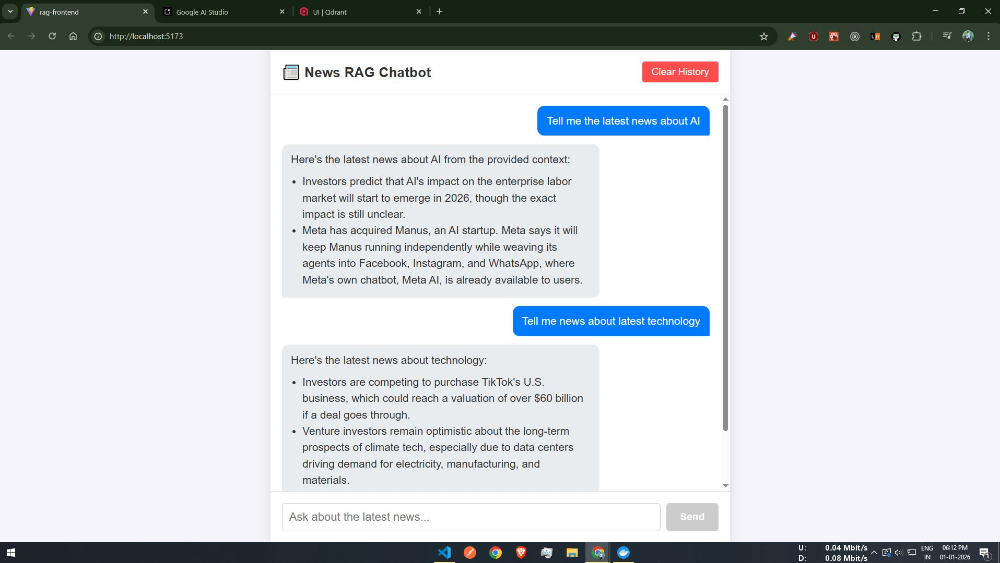

# 📰 News RAG Chatbot -- Backend API


## 🏗️ Architecture Diagram


**Flow:**
- News is fetched and chunked by `ingest.js` from multiple RSS feeds.
- Chunks are embedded via Jina and stored in Qdrant.
- User queries hit the Express API, which retrieves context from Qdrant, manages chat history in Redis, and generates answers using Gemini.

A production-ready backend service for a **Retrieval-Augmented
Generation (RAG) News Chatbot**, built using Node.js, Qdrant, Redis,
Jina Embeddings, and Google Gemini. It ingests real-time news, stores
semantic vectors, retrieves context, and generates grounded AI
responses.

## ⭐ Overview

This backend handles:

-   Fetching and chunking news articles from RSS feeds\
-   Generating embedding vectors using **Jina Embeddings v2**\
-   Storing and searching vectors in **Qdrant**\
-   Maintaining chat sessions using **Redis**\
-   Generating context-aware responses using **Google Gemini**\
-   Exposing REST APIs for chat interactions and session management

## 🛠️ Tech Stack

  Component          Technology
  ------------------ ------------------------
  Runtime            Node.js (Express.js)
  LLM                Google Gemini
  Embeddings         Jina Embeddings v2
  Vector Database    Qdrant (Docker)
  Cache / Sessions   Redis (Docker)
  Data Source        RSS Feeds (TechCrunch, BBC, Guardian, Al Jazeera)

## 🚀 Features

### 🔹 RAG Pipeline

-   Fetches news from RSS\
-   Chunks content\
-   Generates embeddings\
-   Stores semantic vectors in Qdrant

### 🔹 Context-Aware Chat

-   Retrieves top-k relevant articles\
-   Sends grounded context to Gemini\
-   Produces fact-based answers

### 🔹 Session Management

-   Chat history stored per session in Redis\
-   TTL: **24 hours**\
-   Automatic cleanup of inactive sessions

## 📂 Project Structure

    rag-backend/
    │── ingest.js         # News ingestion and vectorization
    │── server.js         # Main Express API server
    │── query.js          # Standalone query/test script
    │── .env
    │── package.json
    └── README.md

## 🏗️ Demo Screenshot


## ⚙️ Installation & Setup

### 1️⃣ Prerequisites

-   Node.js v18+\
-   Docker installed

### 2️⃣ Start Required Services

#### Start Qdrant

``` bash
docker run -d -p 6333:6333   -v $(pwd)/qdrant_storage:/qdrant/storage   qdrant/qdrant
```

#### Start Redis

``` bash
docker run -d -p 6379:6379 redis
```

### 3️⃣ Install Dependencies

``` bash
npm install
```

### 4️⃣ Environment Variables

Create a `.env` file:

  JINA_API_KEY=your_jina_api_key
  GEMINI_API_KEY=your_gemini_api_key

### 5️⃣ Ingest News Articles

```bash
node ingest.js
```

This will fetch and chunk news from multiple RSS feeds (TechCrunch, BBC, Guardian, Al Jazeera), generate embeddings for each chunk, and store them in Qdrant. Each article is split into overlapping chunks for better retrieval.

Expected output:

  ✅ Ingestion complete! Articles indexed.

### 6️⃣ Start the Server

```bash
node server.js
```

Server runs at:
**http://localhost:3000**

## 📡 API Endpoints

### **POST /api/chat**

Send a user message and session ID. The backend retrieves relevant news chunks, builds a context, and generates a Gemini-based answer. Chat history is stored in Redis (last 10 messages for context).

Request:

```json
{
  "sessionId": "uuid",
  "message": "What’s the latest in AI?"
}
```

Response:

```json
{
  "reply": "Here is the latest update..."
}
```

### **GET /api/session/:sessionId**

Retrieve chat history for a session (returns all messages, most recent first).

### **DELETE /api/session/:sessionId**

Clear chat history for a session.

## 🧠 Design Decisions & Improvements

- **Multi-source news ingestion**: Now fetches from TechCrunch, BBC, Guardian, Al Jazeera.
- **Chunked context**: Articles are split into overlapping chunks for better semantic search.
- **Improved context retrieval**: Top 5 relevant chunks are retrieved and used for Gemini prompts.
- **Session management**: Last 10 messages are used for context, stored in Redis with 24h TTL.
- **Error handling**: Graceful fallback if no relevant news is found.
- **Standalone query.js**: For testing queries and context retrieval without running the server.

## 📦 Dependencies

Key NPM packages:

- express, cors, dotenv, axios
- @qdrant/js-client-rest
- @google/generative-ai
- ioredis
- rss-parser
- uuid

See package.json for full list.

## 📝 Summary

This backend provides a clean, modular, and scalable RAG system using modern AI tools. It supports multi-source news ingestion, chunked semantic search, grounded chat responses, and efficient session handling.
